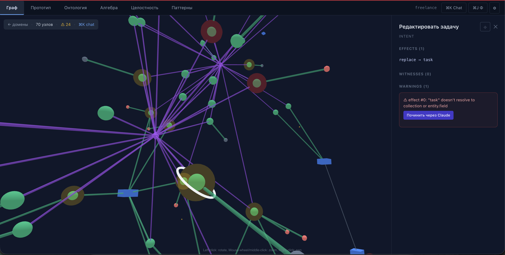
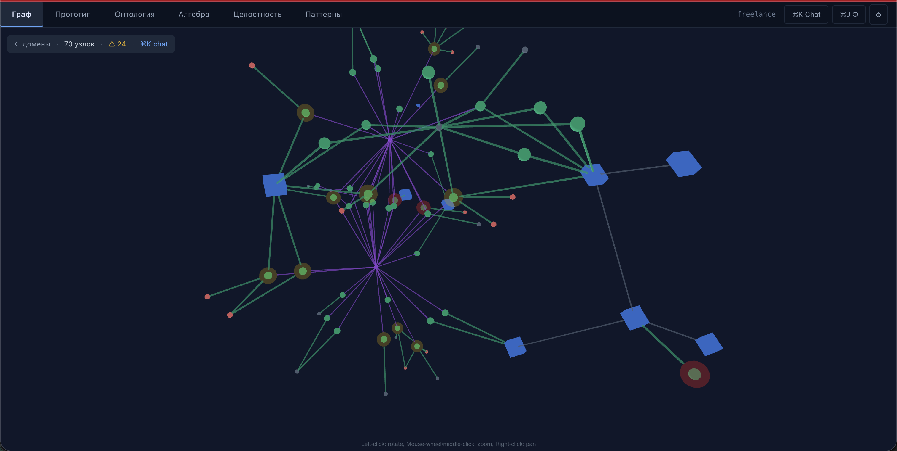
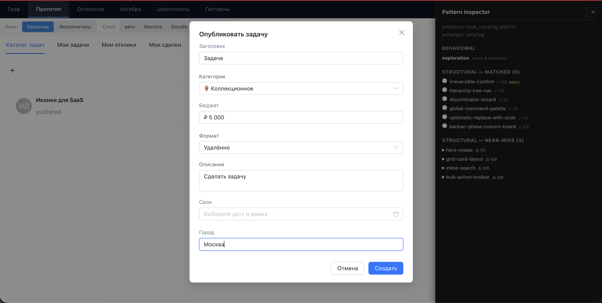
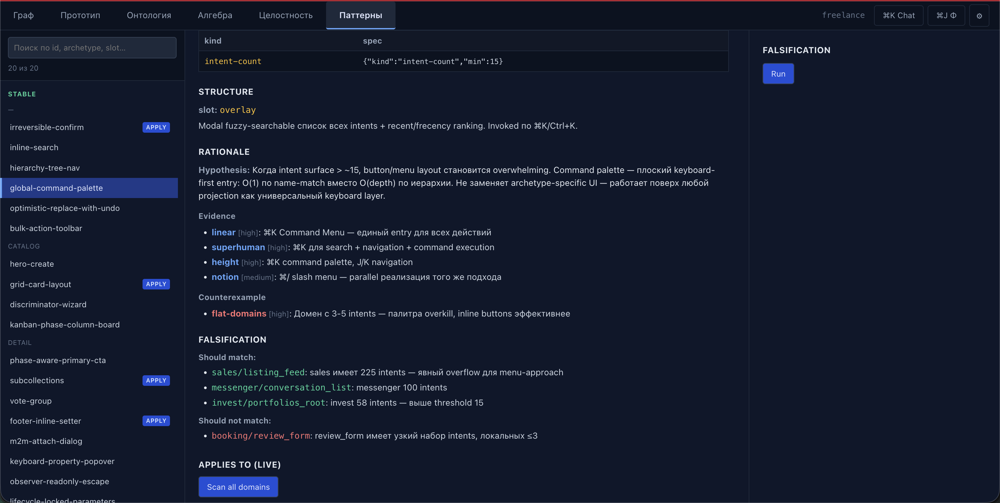
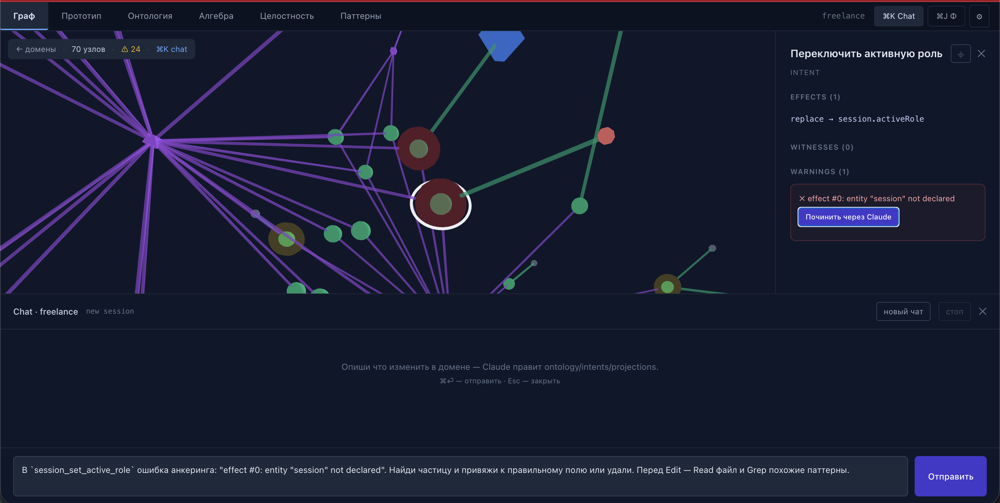
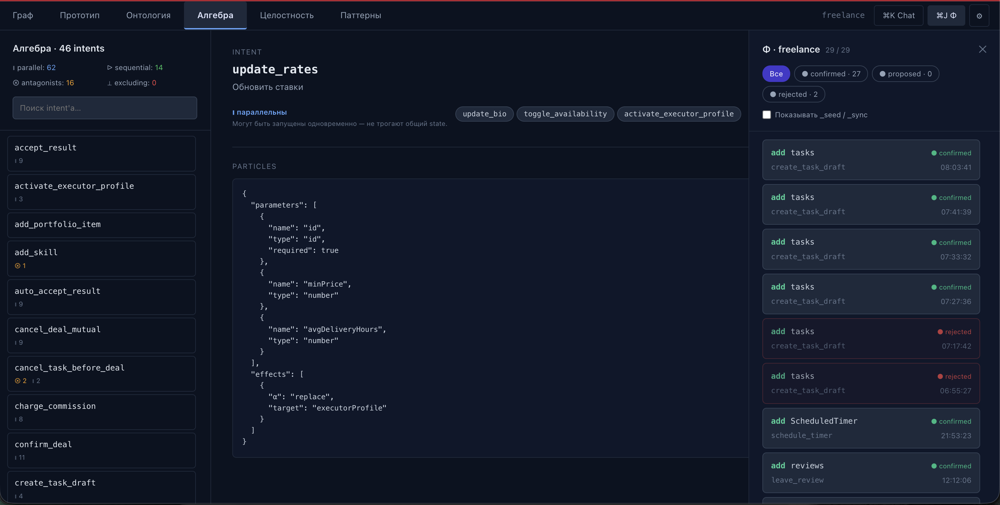
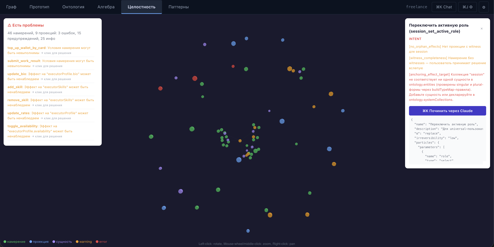

# IDF SDK

Reusable npm packages для парадигмы Intent-Driven Frontend.



## Quick Start (для соло-фрилансеров, строящих CRUD-платформы)

```bash
npx create-idf-app my-crm
cd my-crm
```

Выбери источник схемы (один из трёх):

```bash
# У тебя есть Postgres/Supabase
DATABASE_URL="postgres://..." idf import postgres --enrich

# У тебя есть OpenAPI spec
idf import openapi --file openapi.yaml

# У тебя есть Prisma schema
idf import prisma --file prisma/schema.prisma
```

Настрой auth (JWT / Supabase / none) в `.env`, запусти:

```bash
npm install
npm run dev    # localhost:5173 с useHttpEngine + sign-in UI
vercel deploy  # production с serverless BFF
```

Подробности:
- [docs/quickstart.md](docs/quickstart.md) — пошаговый walkthrough
- [docs/importers.md](docs/importers.md) — 3 importer'а + conventions
- [docs/auth.md](docs/auth.md) — JWT + Supabase setup
- [docs/materializers.md](docs/materializers.md) — document / voice / agent BFF handlers

## Пакеты

- **@intent-driven/core** — engine, fold, intentAlgebra, crystallize_v2, materializers (pixels/voice/agent-API/document/auditLog), invariants (6 kinds incl. expression), baseRoles, preapprovalGuard, **Pattern Bank** (32 stable — 30 с `structure.apply`, 2 matching-only; 49+ candidate в idf/pattern-bank/), matching-score adapter resolution, salience declaration-order ladder
- **@intent-driven/renderer** — ProjectionRendererV2, 7 архетипов (incl. synthesized ArchetypeForm create/edit), primitives (atoms/containers/chart/map/IrreversibleBadge/PatternPreviewOverlay/TreeNav/KanbanBoard/SubCollectionSection/Countdown/UndoToast/AuthForm), AdapterProvider (Context + hooks), `pickAdaptedComponent` со scoring, xrayMode/slotAttribution props
- **@intent-driven/engine** — Φ-lifecycle extraction (proposed/confirmed/rejected, fold, ruleEngine hooks, rule.warnAt secondary timers) — для headless-хостов
- **@intent-driven/adapter-mantine** — corporate / data-dense + shell.sidebar
- **@intent-driven/adapter-shadcn** — handcrafted / doodle + shell.sidebar
- **@intent-driven/adapter-apple** — premium / visionOS-glass + shell.sidebar
- **@intent-driven/adapter-antd** — enterprise-fintech / dashboard + shell.formHeader
- **@intent-driven/canvas-kit** — SVG-утилиты для domain canvas

### Пакеты для scaffold-пути (Этапы 1-3)

- **@intent-driven/create-idf-app** — `npx create-idf-app my-app` scaffold
- **@intent-driven/importer-postgres** — Postgres `information_schema` → ontology (CRUD + FK-relations + role-inference)
- **@intent-driven/importer-openapi** — OpenAPI 3.x spec → ontology (`$ref` resolution, operationId override)
- **@intent-driven/importer-prisma** — `.prisma` → ontology (через `@mrleebo/prisma-ast`)
- **@intent-driven/enricher-claude** — AI-обогащение ontology через subprocess к локальному `claude` CLI (cache + suggestions apply)
- **@intent-driven/effect-runner-http** — runtime HTTP CRUD для IDF intents (useHttpEngine React hook)
- **@intent-driven/auth** — JWT + Supabase providers + useAuth hook
- **@intent-driven/server** — BFF handlers (document / voice / agent) для Vercel-style serverless functions
- **@intent-driven/cli** — `idf init` (LLM-генерация), `idf import postgres|openapi|prisma`, `idf enrich`

## IDF Studio

Авторская среда (§27 манифеста) для проектирования онтологии, намерений и проекций. Показывает один артефакт с шести сторон.

### Граф онтологии
Entities / roles / references визуально, с подсветкой ownership и ranges.



### Живой прототип
Проекции рендерятся прямо в среде — кристаллизатор выполняется на каждое изменение intents/ontology.



### Pattern Inspector
Preview/Commit режим для stable Pattern Bank. Подсвечивает derived-слоты через `PatternPreviewOverlay` и показывает explanation каждого match/near-miss.



### Chat-пилот с Claude
Claude haiku/sonnet/opus через subprocess; system prompt со спецификацией кешируется (>90% скидка). Генерирует и уточняет intents через разговор.



### Алгебра намерений
Визуализация связей ▷ ⇌ ⊕ ∥ (causal / antagonistic / merge / parallel). Помогает видеть lifecycle-phases и причинные цепочки.



### Checks & invariants
Real-time статус 6-kind global invariants (role-capability / referential / transition / cardinality / aggregate / expression) + integrity-правил.



## Разработка

```bash
pnpm install
pnpm -r build
pnpm -r test
```

## Использование в эталонном приложении

В `idf/package.json`:
```json
{
  "dependencies": {
    "@intent-driven/core": "file:../idf-sdk/packages/core"
  }
}
```

Тогда `npm install` в idf/ берёт пакет напрямую из dist/. После изменений в SDK:
```bash
cd ../idf-sdk/packages/core && pnpm build
cd ../../../idf && npm install --force
```

## CI

`.github/workflows/ci.yml` — на каждый PR и push в `main`:
- matrix по Node 20 и 22
- `pnpm install --frozen-lockfile`
- `pnpm -r build`
- `pnpm -r test`

Предпосылки: `pnpm-lock.yaml` всегда коммитится, `dist/` — нет (см. `.gitignore`).

## Версионирование и релиз (changesets)

Используется [`@changesets/cli`](https://github.com/changesets/changesets). Каждое публичное изменение сопровождается changeset-файлом.

### Workflow

```bash
# После изменения в пакете:
pnpm changeset
# Выбрать затронутые пакеты, тип бампа (patch/minor/major), написать summary.
# Создастся .changeset/<name>.md — закоммитить вместе с кодом.

git add .changeset/*.md
git commit -m "feat(core): ..."
git push
```

### Что делает release workflow

`.github/workflows/release.yml` на push в `main`:

1. Если в репо есть unreleased changesets → открывает/обновляет **Version PR** с бампом версий и сгенерированным CHANGELOG.md в каждом пакете.
2. Когда этот Version PR мержится → снова срабатывает; changesets уже применены → запускает `pnpm release` (`pnpm -r build && changeset publish`) и публикует затронутые пакеты в npm.

### Секреты GitHub

В `Settings → Secrets → Actions`:
- `NPM_TOKEN` — npm automation token с правом publish для scope `@intent-driven`

`GITHUB_TOKEN` выдаётся автоматически (permissions: contents/pull-requests в release.yml).

### Первая публикация в npm

Scope `@intent-driven` должен существовать в npm; организация — `intent-driven` либо `@intent-driven` как user-scope. Пакеты помечены `"publishConfig": { "access": "public" }`.

```bash
pnpm changeset                # создать changeset (minor для первого релиза)
# закоммитить, замержить в main
# GitHub Actions откроет Version PR → замержить
# после merge — автоматический publish
```

## Локальная публикация (опционально, через verdaccio)

```bash
bash scripts/verdaccio-up.sh    # запустить verdaccio
bash scripts/publish-local.sh   # опубликовать в локальный registry
```

См. `../idf/docs/superpowers/specs/2026-04-14-sdk-extraction-design.md`.
